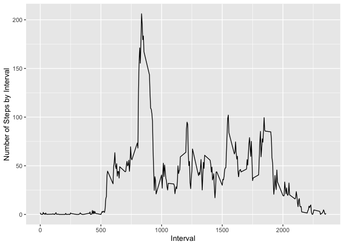

## Loading and preprocessing the data

The data for the analysis is loaded from the original zip file.  
The classes are set in the read.csv function to avoid further formatting.  


```r
data <- read.csv(unz("activity.zip", "activity.csv"),
                  colClasses = c("numeric", "Date", "numeric"))
```

## What is mean total number of steps taken per day?

First, we use tapply to get the number of steps taken each day. For now, we 
ignore the missing values.  
Then, we used ggplot2's qplot to create a simple histogram.  


```r
stepsday <- tapply(data$steps, data$date, sum, na.rm = TRUE)
library(ggplot2)
qplot(stepsday, xlab = "Steps taken per day", bins = 40)
```

<!-- -->

Now, we use simple calls to know the mean and median of the total steps per day.  
The mean is:  


```r
mean(stepsday)
```

```
## [1] 9354.23
```

And the median is:  


```r
median(stepsday)
```

```
## [1] 10395
```

## What is the average daily activity pattern?


```r
activ <- tapply(data$steps, data$interval, mean, na.rm = TRUE)
qplot(as.numeric(names(activ)), activ, geom = "line", xlab = "Interval",
      ylab = "Number of Steps by Interval")
```

<!-- -->

Now, we look for the interval that has the most average steps.  
First, the ID of that interval is:  


```r
names(activ[which(activ == max(activ))])
```

```
## [1] "835"
```

And, the average number of steps for that interval is:  


```r
max(activ)
```

```
## [1] 206.1698
```

## Imputing missing values

The number of missing values in the data set is:  


```r
sum(is.na(data$steps))
```

```
## [1] 2304
```

Now, we will use the average of values each interval to fill the spots with NAs.  
To do this, we will create a function that takes the steps and interval of an 
observation and sees if there is a missing values. Then, if there is a missing 
value, it will fill that position with the average value for that interval.  
The new data is then used to create a new data set.


```r
rmNA <- function(x, i, avg) {
    if(is.na(x)) {
        x <- avg[as.character(i)]
    }
    x
}
new_st <- mapply(rmNA, data$steps, data$interval, MoreArgs = list(avg = activ))
new_data <- data
new_data$steps <- new_st
```

Finally, we use the same procedure as before to calculate the mean and median.
The new mean is:  


```r
newstepsd <- tapply(new_data$steps, new_data$date, sum)
mean(newstepsd)
```

```
## [1] 10766.19
```

And the new median is:  


```r
median(newstepsd)
```

```
## [1] 10766.19
```

There was a noticeable increase in both the mean and median due to the removal 
of missing values.

## Are there differences in activity patterns between weekdays and weekends?

First, we create a factor that defines whether a date is weekday or a 
weekend day.  
To do this, we use the weekdays function and use boolean operations to know the 
factor value.


```r
wkds <- weekdays(new_data$date)
wknd <- wkds == "Saturday" | wkds == "Sunday"
wknd <- factor(wknd, levels = c(TRUE, FALSE), labels = c("weekend", "weekday"))
```

Now, we apply the same operation we used in the previous step to get the mean 
of all the intervals and then we plot the result using qplot.


```r
steps_wkds <- tapply(new_data[which(wknd == "weekday") ,]$steps,
                     new_data[which(wknd == "weekday") ,]$interval, mean)
steps_wknd <- tapply(new_data[which(wknd == "weekend") ,]$steps,
                     new_data[which(wknd == "weekend") ,]$interval, mean)
graph_data <- data.frame(steps = c(steps_wkds, steps_wknd),
                         interval = c(names(steps_wkds), names(steps_wknd)),
                         week = factor(c(rep("weekday", length(steps_wkds)),
                                       rep("weekend", length(steps_wknd)))))
qplot(as.numeric(interval), steps, data = graph_data, facets = week~.,
      geom = "line", xlab = "Interval", ylab = "Number of steps")
```

<!-- -->

Both of the final graphs have a similar behavior to the original plot.
